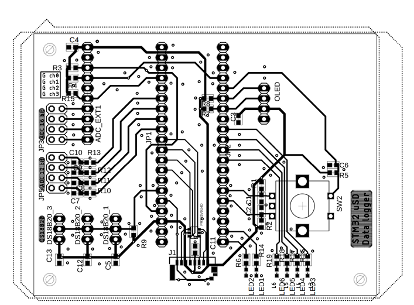
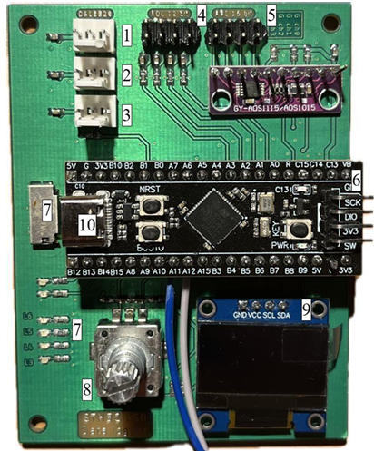
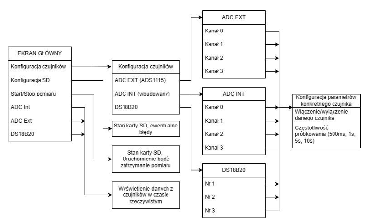
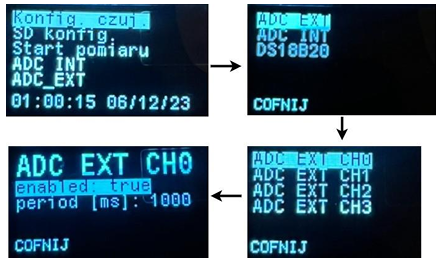

# STM32 µSD-Datalogger
## ENGLISH BELOW 
## PL
Założeniem projektu było stworzenie konfigurowalnego, małego rejestratora danych pomiarowych, dostosowanych stricte pod wymagania użytkownika. 

## Założenia:
- Zapis danych na kartę microSD,
- Konfigurowalny rodzaj i ilość czujników oraz sposób raportowania (częstotliwość i stan) 
- Pomiar temperatury
- Pomiar napięcia
- Interfejs użytkownika via OLED i enkoder
- Forma nakładki (shield) na STM32 Black pill

## Komponenty: 
- Mikrokontroler: STM32F411CEU6 typu Blackpill
- Czujnik temperatury MAXIM DS18B20
- Przetwornik ADC ADS1115
- Wbudowany przetwornik ADC

### Główne pliki projektu w repozytorium
```
\Core\src\*.c
\Core\inc\*.h
```

## Projekt PCB


## Gotowy datalogger


## Podział modułów
```adc.c – instrukcje związane z obsługą przetworników analogowo-cyfrowych, 
• ds18b20.c – instrukcje związane z obsługą termometru DS18B20, 
• encoder.c – instrukcje związane z obsługą enkodera obrotowego, 
• main.c – główny plik programu  
• menu.c – instrukcje związane z obsługą menu i interfejsu użytkownika, 
• save.c – instrukcje związane z zapisem pomiarów, 
• sd.c – instrukcje związane z obsługą karty SD. 
```

## Schemat interfejsu użytkownika



### Edycja interfejsu użytkownika

```c
menu.h

struct Menu {
   ...
};

typedef struct MenuEntry {
   ...
} MenuEntry;

typedef enum {
	...
}
```

## Przejście po ekranach interfejsu


## Logika pomiarowa

Wykorzystano przerwania w celu definiowania momentu odczytu z danego czujnika. Zdefiniowane są 4 kanały, każdy o różnym czasie próbkowania. Przerwania generowane są za pomocą wbudowanego w mikrokontroler licznika w trybie Output Compare No Output (zliczanie do wartości w rejestrze CCRx). W procedurze obsługi przerwania wywoływany jest callback.

## Zapis na kartę microSD
Wykorzystana biblioteka systemu plików FatFS z użyciem itnerfejsu SPI "cubeide-sd-card" ~ kiwih

Zapis przez bufor kołowy (100 pozycji) i kontroler FatFS do pliku .csv na karcie microSD. 

W każdej linijce wszystkie zapisane informacje z czujników oraz sygnatura czasowa z zegara RTC.

## Debug
Zaimplementowane komunikaty związane z kontrolerem SD poprzez port COM (mostek UART<->USB)

## Pomiary 
- pomiary liniowości przetwornika ADC 
- Pomiar błędu wzmocnienia
- Pomiar czasu pracy przy typowym użytkowaniu


# EN
The premise of the project was to create a configurable, small measurement data logger, tailored strictly to the user's requirements. 

## Assumptions:
- Data storage on a microSD card,
- Configurable type and number of sensors and reporting method (frequency and status) 
- Temperature measurement
- Voltage measurement
- User interface via OLED and encoder
- Form of overlay (shield) on STM32 Black pill.

## Components: 
- Microcontroller: STM32F411CEU6 type Blackpill
- MAXIM DS18B20 temperature sensor
- ADC converter ADS1115
- Built-in ADC converter

## PCB design


## Finished datalogger


## Breakdown of the modules
```
- adc.c - instructions related to the operation of analog-to-digital     converters, 
- ds18b20.c - instructions related to the operation of the DS18B20 thermometer, 
- encoder.c - instructions related to the operation of the rotary encoder, 
- main.c - main program file  
- menu.c - instructions related to menu and user interface operation, 
- save.c - instructions related to saving measurements, 
- sd.c - instructions related to SD card operation. 
```

## User Interface schema


## Overview of UI code

```c
menu.h

struct Menu {
   ...
};

typedef struct MenuEntry {
   ...
MenuEntry { ... };

typedef enum {
	...
}
```

## Passing through the interface screens


## Measurement logic
Interrupts have been used to define the timing of readings from a given sensor. Four channels are defined, each with different sampling times. Interrupts are generated using the microcontroller's built-in counter in Output Compare No Output mode (counting to the value in the CCRx register). A callback is called in the interrupt handler routine.

## Writing to a microSD card
Used FatFS file system library using itnerface SPI “cubeide-sd-card”. ~ kiwih

Writing via circular buffer (100 items) and FatFS controller to .csv file on microSD card. 

In each line, all the stored sensor information and the time signature from the RTC clock.

## Debug
Implemented messages related to SD controller via COM port (UART<->USB bridge).

## Measurements 
- ADC linearity measurements 
- Gain error measurement
- Measurement of operating time under typical use