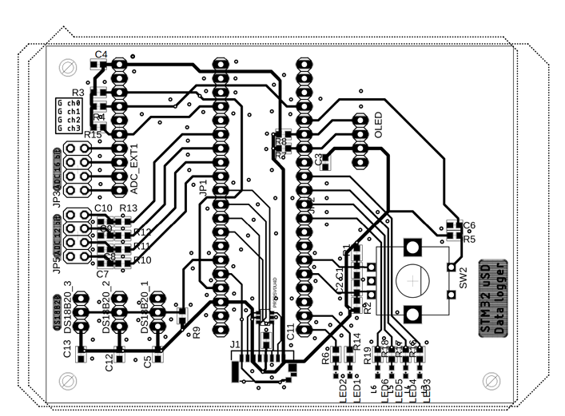
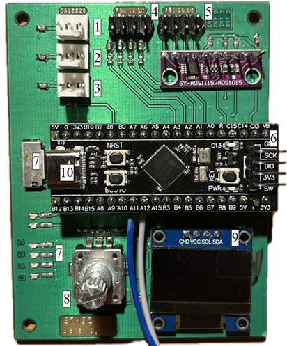
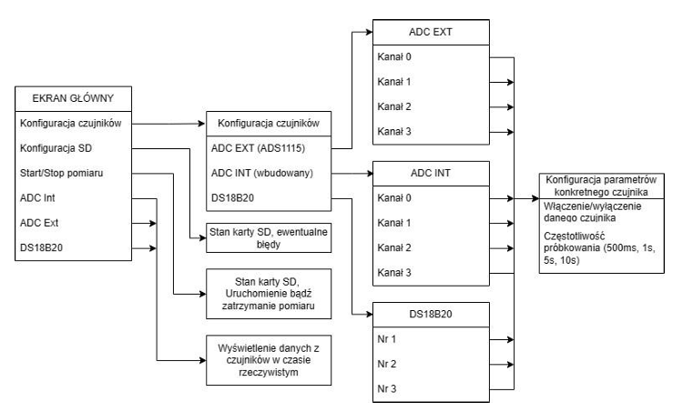
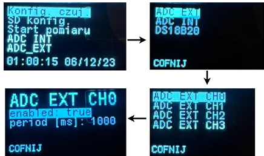

# STM32 µSD-Datalogger

[Polski opis projektu](https://github.com/miwierzbicki/stm_datalogger/tree/dev?tab=readme-ov-file#pl)

The primary objective of this project was to develop a configurable, compact measurement data logger, strictly tailored to specific user requirements.

## Key Features:
- Data logging capability to a microSD card.
- Configurable sensor type and quantity.
- Configurable reporting parameters (frequency and status/state).
- Temperature measurement functionality.
- Voltage measurement functionality.
- User interface implemented via an OLED display and a rotary encoder.
- Designed as a shield form factor for the STM32 Black Pill board.
  
## Components: 
- **Microcontroller:** STM32F411CEU6 (Black Pill development board).
- **Temperature Sensor:** Maxim DS18B20.
- **ADC Converter:** ADS1115 (External).
- **Internal ADC:** Utilizes the built-in ADC of the STM32F411CEU6 microcontroller.

## PCB design


## Finished datalogger


## Breakdown of the modules
```
- adc.c – Handles operations related to the Analog-to-Digital Converters (ADCs).
- ds18b20.c – Handles communication with the DS18B20 temperature sensor.
- encoder.c – Handles the rotary encoder input.
- main.c – The main program file.
- menu.c – Manages the menu system and user interface logic.
- save.c – Handles the saving of measurement data.
- sd.c – Handles SD card operations.
```

## User Interface schema



## Overview of UI code

```c
menu.h

struct Menu {
   ...
};

typedef struct MenuEntry {
   ...
MenuEntry { ... };

typedef enum {
	...
}
```

## UI Screen flow


## Measurement logic
Interrupts are utilized to define the timing for sensor readings. Four channels are defined, each with a different sampling rate. Interrupts are generated using the microcontroller's built-in timer in Output Compare No Output mode (counting up to the value in the CCRx register). A callback function is invoked within the interrupt service routine (ISR).

## Writing to a microSD card
The FatFS file system library is used via the SPI interface, utilizing the "cubeide-sd-card" library by kiwih.

Data is written through a circular buffer (100 entries) and managed by the FatFS controller to a .csv file on the microSD card.

Each line in the file contains all recorded sensor data along with a timestamp from the Real-Time Clock (RTC).

## Debug
Debugging messages related to the SD card controller are implemented and output via the COM port (using a UART<->USB bridge).

## Measurements / Testing

###   ADC linearity measurements.
* Voltage measurements compared against a reference standard show that the converter's response closely matches the ideal characteristic after linear fitting. This confirms good linearity across the full measurement range.

###  Gain error measurement.
* The difference between the values obtained from the analog-to-digital converter and the reference standard was calculated. This discrepancy was observed to decrease as the measured voltage decreased. Consequently, this allows for the potential development of correction functions in future enhancements to achieve better converter calibration within the desired measurement range.

###   Operating time measurement under typical usage conditions.
* Assuming a worst-case average current consumption scenario of 35 mA, the average operating time of the device was estimated when powered by a portable battery bank (power bank) with a nominal capacity of 10 Ah at a battery voltage of 3.7 V. Due to the necessary voltage conversion from the cells' 3.7 V to the required 5 V level, this power bank would have an effective capacity of approximately 7.4 Ah.

* Based on these figures, it was calculated that the theoretical operating time of the device powered by the aforementioned power bank would be 102 days. This represents an ideal value and does not account for conversion losses or fluctuations in the datalogger's current draw.


# PL 

Założeniem projektu było stworzenie konfigurowalnego, małego rejestratora danych pomiarowych, dostosowanych stricte pod wymagania użytkownika. 

## Założenia:
- Zapis danych na kartę microSD,
- Konfigurowalny rodzaj i ilość czujników oraz sposób raportowania (częstotliwość i stan) 
- Pomiar temperatury
- Pomiar napięcia
- Interfejs użytkownika via OLED i enkoder
- Forma nakładki (shield) na STM32 Black pill

## Komponenty: 
- Mikrokontroler: STM32F411CEU6 typu Blackpill
- Czujnik temperatury MAXIM DS18B20
- Przetwornik ADC ADS1115
- Wbudowany przetwornik ADC

### Główne pliki projektu w repozytorium
```
\Core\src\*.c
\Core\inc\*.h 
```

## Projekt PCB


## Gotowy datalogger


## Podział modułów
```adc.c – instrukcje związane z obsługą przetworników analogowo-cyfrowych, 
• ds18b20.c – instrukcje związane z obsługą termometru DS18B20, 
• encoder.c – instrukcje związane z obsługą enkodera obrotowego, 
• main.c – główny plik programu  
• menu.c – instrukcje związane z obsługą menu i interfejsu użytkownika, 
• save.c – instrukcje związane z zapisem pomiarów, 
• sd.c – instrukcje związane z obsługą karty SD. 
```

## Schemat interfejsu użytkownika


### Edycja interfejsu użytkownika

```c
menu.h

struct Menu {
   ...
};

typedef struct MenuEntry {
   ...
} MenuEntry;

typedef enum {
	...
}
```

## Przejście po ekranach interfejsu


## Logika pomiarowa

Wykorzystano przerwania w celu definiowania momentu odczytu z danego czujnika. Zdefiniowane są 4 kanały, każdy o różnym czasie próbkowania. Przerwania generowane są za pomocą wbudowanego w mikrokontroler licznika w trybie Output Compare No Output (zliczanie do wartości w rejestrze CCRx). W procedurze obsługi przerwania wywoływany jest callback.

## Zapis na kartę microSD
Wykorzystana biblioteka systemu plików FatFS z użyciem itnerfejsu SPI "cubeide-sd-card" ~ kiwih

Zapis przez bufor kołowy (100 pozycji) i kontroler FatFS do pliku .csv na karcie microSD. 

W każdej linijce wszystkie zapisane informacje z czujników oraz sygnatura czasowa z zegara RTC.

## Debug
Zaimplementowane komunikaty związane z kontrolerem SD poprzez port COM (mostek UART<->USB)

## Pomiary 
- pomiary liniowości przetwornika ADC 
- Pomiar błędu wzmocnienia
- Pomiar czasu pracy przy typowym użytkowaniu

